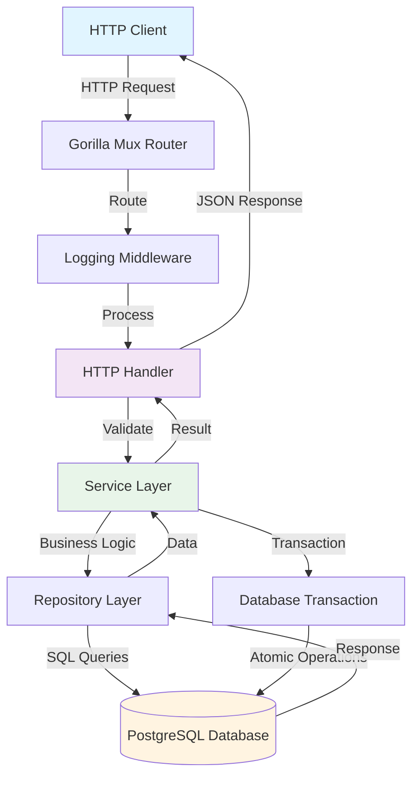
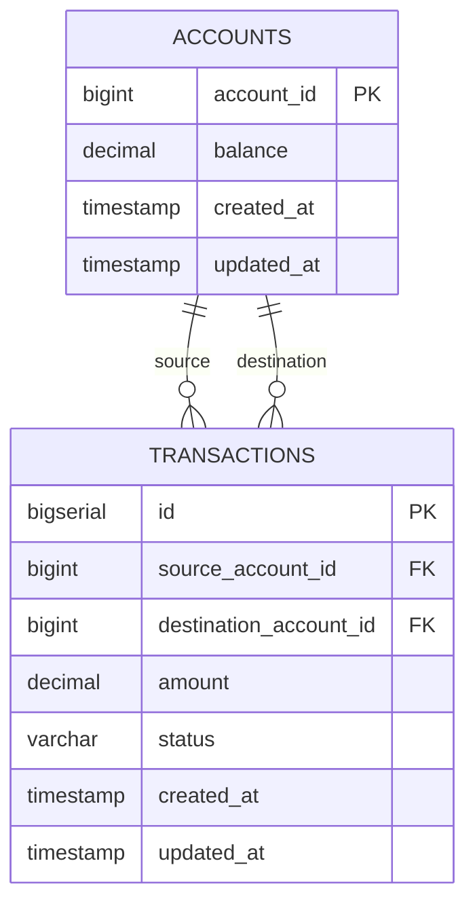

# Internal Transfers System

A robust, production-ready internal transfers application built with Go that facilitates financial transactions between accounts. This system provides HTTP endpoints for account management and transaction processing with strong data integrity guarantees.

## Features

- **Account Management**: Create accounts with initial balances and query account information
- **Transaction Processing**: Process transfers between accounts with atomic operations
- **Data Integrity**: Database transactions ensure consistency and prevent race conditions
- **Error Handling**: Comprehensive error handling for various edge cases
- **Request Validation**: Input validation for all API endpoints
- **Transaction Logging**: Complete audit trail of all transactions
- **Decimal Precision**: High-precision decimal handling for financial calculations

## Tech Stack

- **Language**: Go 1.21+
- **Database**: PostgreSQL
- **HTTP Router**: Gorilla Mux
- **Database Driver**: lib/pq (PostgreSQL driver)

## Project Structure

```
.
├── main.go                 # Application entry point
├── go.mod                  # Go module dependencies
├── .env.example           # Environment variables template
├── config/
│   └── config.go          # Configuration management
├── models/
│   ├── account.go         # Account model and request types
│   ├── transaction.go     # Transaction model and request types
│   ├── account_test.go    # Account model tests
│   └── transaction_test.go # Transaction model tests
├── database/
│   └── database.go        # Database connection and migrations
├── repository/
│   ├── account_repository.go      # Account data access layer
│   └── transaction_repository.go  # Transaction data access layer
├── service/
│   ├── account_service.go      # Account business logic
│   └── transaction_service.go   # Transaction business logic
├── handlers/
│   ├── account_handler.go       # Account HTTP handlers
│   ├── transaction_handler.go   # Transaction HTTP handlers
│   └── error_helpers.go         # Error handling utilities
└── middleware/
    └── logging.go               # HTTP request logging middleware
```

## System Architecture

### Architecture Overview

The application follows a **layered architecture (3-tier)** pattern:

1. **Presentation Layer**: HTTP handlers that process incoming requests
2. **Business Logic Layer**: Services that implement business rules and orchestrate operations
3. **Data Access Layer**: Repositories that interact with the database

This architecture ensures separation of concerns, making the codebase maintainable, testable, and scalable.

### Component Flow Diagram



### Request Flow

1. **Client** sends HTTP request to the API
2. **Router** matches the request to the appropriate handler
3. **Middleware** logs the request
4. **Handler** validates the request and calls the service
5. **Service** implements business logic and coordinates with repositories
6. **Repository** executes database queries within a transaction (for transfers)
7. **Database** stores/retrieves data atomically
8. Response flows back through the layers to the client

## Database Schema

### Entity-Relationship Diagram



### Tables

#### Accounts Table
- `account_id` (BIGINT, PRIMARY KEY): Unique identifier for the account
- `balance` (DECIMAL(20, 10)): Current account balance with high precision
- `created_at` (TIMESTAMP): Account creation timestamp
- `updated_at` (TIMESTAMP): Last update timestamp

#### Transactions Table
- `id` (BIGSERIAL, PRIMARY KEY): Auto-incrementing transaction ID
- `source_account_id` (BIGINT, FOREIGN KEY): Source account reference
- `destination_account_id` (BIGINT, FOREIGN KEY): Destination account reference
- `amount` (DECIMAL(20, 10)): Transaction amount with high precision
- `status` (VARCHAR(20)): Transaction status (pending, completed, failed)
- `created_at` (TIMESTAMP): Transaction creation timestamp
- `updated_at` (TIMESTAMP): Last update timestamp

### Indexes
- Index on `transactions.source_account_id` for fast lookups
- Index on `transactions.destination_account_id` for fast lookups
- Index on `transactions.status` for status-based queries
- Index on `transactions.created_at` for time-based queries

## Installation and Setup

### Prerequisites

- Go 1.21 or higher
- PostgreSQL 12 or higher
- Git

### Step 1: Clone the Repository

```bash
git clone <repository-url>
cd TripleA-backend-assignment
```

### Step 2: Install Dependencies

```bash
go mod download
```

### Step 3: Set Up PostgreSQL Database

Create a PostgreSQL database:

```bash
createdb transfers_db
```

Or using psql:

```sql
CREATE DATABASE transfers_db;
```

### Step 4: Configure Environment Variables

Copy the example environment file:

```bash
cp .env.example .env
```

Edit `.env` with your database credentials:

```env
SERVER_HOST=localhost
SERVER_PORT=8080

DB_HOST=localhost
DB_PORT=5432
DB_USER=postgres
DB_PASSWORD=your_password
DB_NAME=transfers_db
DB_SSLMODE=disable
```

### Step 5: Run Database Migrations

The application automatically runs migrations on startup. The migrations create the necessary tables and indexes.

### Step 6: Run the Application

```bash
go run main.go
```

The server will start on `http://localhost:8080` (or the port specified in your `.env` file).

## Running the Application

### Development Mode

```bash
go run main.go
```

### Build and Run

```bash
go build -o transfers-api main.go
./transfers-api
```

### Run Tests

```bash
go test ./...
```

To run tests with coverage:

```bash
go test -cover ./...
```

## API Endpoint Documentation

### Base URL

All endpoints are relative to: `http://localhost:8080`

### 1. Create Account

Creates a new account with an initial balance.

**Endpoint**: `POST /accounts`

**Request Body**:
```json
{
  "account_id": 123,
  "initial_balance": "100.23344"
}
```

**Request Parameters**:
- `account_id` (integer, required): Unique account identifier (must be positive)
- `initial_balance` (string, required): Initial balance as a decimal string (must be non-negative)

**Success Response**: `201 Created`
- Empty response body

**Error Responses**:
- `400 Bad Request`: Invalid request body, validation errors, or account already exists
- `500 Internal Server Error`: Server error

**Example**:
```bash
curl -X POST http://localhost:8080/accounts \
  -H "Content-Type: application/json" \
  -d '{
    "account_id": 123,
    "initial_balance": "100.23344"
  }'
```

### 2. Get Account

Retrieves account information including current balance.

**Endpoint**: `GET /accounts/{account_id}`

**URL Parameters**:
- `account_id` (integer, required): The account ID to query

**Success Response**: `200 OK`
```json
{
  "account_id": 123,
  "balance": "100.23344"
}
```

**Error Responses**:
- `400 Bad Request`: Invalid account_id format
- `404 Not Found`: Account does not exist
- `500 Internal Server Error`: Server error

**Example**:
```bash
curl http://localhost:8080/accounts/123
```

### 3. Process Transaction

Processes a transfer between two accounts. This operation is atomic - both accounts are updated or neither is updated.

**Endpoint**: `POST /transactions`

**Request Body**:
```json
{
  "source_account_id": 123,
  "destination_account_id": 456,
  "amount": "100.12345"
}
```

**Request Parameters**:
- `source_account_id` (integer, required): Source account ID (must be positive)
- `destination_account_id` (integer, required): Destination account ID (must be positive, different from source)
- `amount` (string, required): Transfer amount as a decimal string (must be greater than zero)

**Success Response**: `201 Created`
- Empty response body

**Error Responses**:
- `400 Bad Request`: Invalid request body, validation errors, insufficient balance, or same source/destination
- `404 Not Found`: Source or destination account does not exist
- `500 Internal Server Error`: Server error

**Example**:
```bash
curl -X POST http://localhost:8080/transactions \
  -H "Content-Type: application/json" \
  -d '{
    "source_account_id": 123,
    "destination_account_id": 456,
    "amount": "100.12345"
  }'
```

### 4. Health Check

Check if the server is running.

**Endpoint**: `GET /health`

**Success Response**: `200 OK`
```
OK
```

**Example**:
```bash
curl http://localhost:8080/health
```

## Assumptions

1. **Single Currency**: All accounts use the same currency. No currency conversion is needed.

2. **No Authentication/Authorization**: As specified in the requirements, authentication and authorization are not implemented. The API is open to all requests.

3. **Decimal Precision**: Balances and amounts are stored as DECIMAL(20, 10) to maintain high precision for financial calculations. They are represented as strings in JSON to avoid floating-point precision issues.

4. **Account IDs**: Account IDs are provided by the client and must be positive integers. The system does not auto-generate account IDs.

5. **Transaction Atomicity**: All transfers are processed within database transactions to ensure atomicity. If any part of the transfer fails, the entire operation is rolled back.

6. **No Negative Balances**: The system prevents transfers that would result in negative balances. The source account must have sufficient funds.

7. **Idempotency**: Creating an account with an existing account_id will return an error. Transaction processing is not idempotent - each request creates a new transaction record.

8. **Concurrent Transactions**: The system uses row-level locking (`SELECT FOR UPDATE`) within database transactions to prevent race conditions. This ensures that concurrent transfers are handled correctly, with accounts being locked during balance checks and updates.

## Error Handling

The application implements comprehensive error handling:

- **Validation Errors**: Returned for invalid input data (400 Bad Request)
- **Not Found Errors**: Returned when accounts don't exist (404 Not Found)
- **Business Logic Errors**: Returned for business rule violations like insufficient balance (400 Bad Request)
- **Server Errors**: Returned for unexpected errors (500 Internal Server Error)

All errors include descriptive messages to help with debugging.

## Data Integrity

The system ensures data integrity through:

1. **Database Transactions**: All transfer operations are wrapped in database transactions. Transactions are only started after pre-validation to minimize connection pool usage and improve efficiency.
2. **Row-Level Locking**: Account rows are locked using `SELECT FOR UPDATE` within transactions to prevent race conditions and ensure consistent balance checks.
3. **Foreign Key Constraints**: Transactions reference valid accounts, preventing orphaned transaction records.
4. **Balance Validation**: Source account balance is validated both before starting the transaction (for early failure) and inside the transaction with row locks (for concurrency safety).
5. **Atomic Updates**: Both account balances are updated atomically within a single transaction. If any part fails, the entire operation is rolled back.
6. **Transaction Logging**: All transactions are logged with status tracking for complete audit trail.

## Testing

The project includes unit tests for model validation:

```bash
# Run all tests
go test ./...

# Run tests with coverage
go test -cover ./...

# Run tests for a specific package
go test ./models/...
```

## Code Quality

The codebase follows Go best practices:

- **Clean Architecture**: Separation of concerns with layered architecture
- **Error Handling**: Proper error wrapping and context
- **Type Safety**: Strong typing with custom Decimal type for financial data
- **Documentation**: Comprehensive comments and documentation
- **Consistent Naming**: Clear, descriptive variable and function names
- **Repository Pattern**: Data access abstraction for testability

## Future Enhancements

Potential improvements for production use:

1. **Authentication & Authorization**: JWT-based authentication
2. **Rate Limiting**: Prevent abuse of the API
3. **Caching**: Redis caching for frequently accessed accounts
4. **Monitoring**: Prometheus metrics and structured logging
5. **API Versioning**: Version the API endpoints
6. **Pagination**: For transaction history queries
7. **Webhooks**: Notify external systems of transactions
8. **Multi-currency Support**: Handle different currencies with conversion
9. **Transaction History**: Endpoint to query transaction history
10. **Batch Transactions**: Process multiple transfers in a single request

## License

This project is part of a backend assignment.
